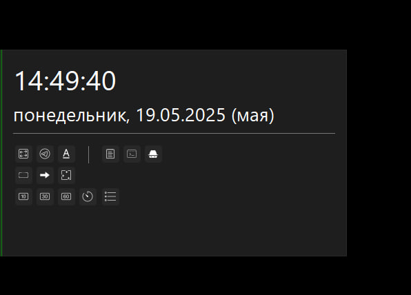
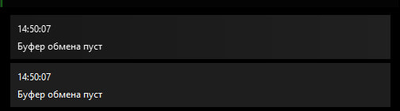
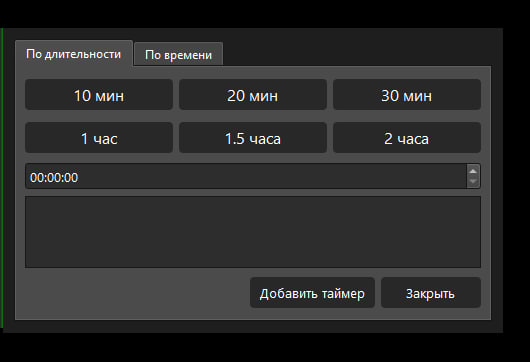
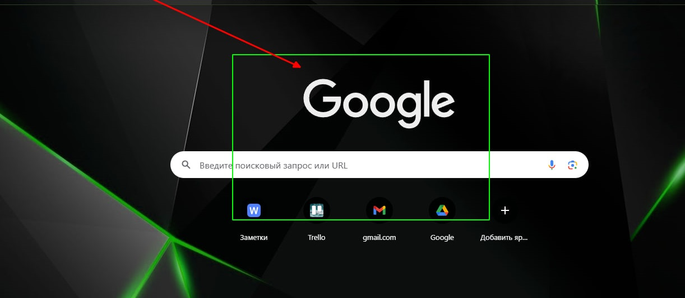

# WinWidget - Виджет для рабочего стола Windows

WinWidget - это удобный виджет для быстрого доступа к инструментам и функциям прямо с края рабочего стола.

## Основные возможности

- **Быстрые инструменты**:
  - Переключение раскладки клавиатуры (RU/EN)
  - Очистка текста от спецсимволов (для AI-текстов)
  - Отправка сообщений в Telegram
  - Инструменты рисования (прямоугольники, стрелки)

- **Системные инструменты**:
  - Запуск Блокнота
  - Открытие командной строки (обычная и админская)
  - Быстрый доступ к Zapret-сервису

- **Таймеры**:
  - Быстрые таймеры (10/30/60 минут)
  - Создание кастомных таймеров
  - Управление активными таймерами

- **Визуальные особенности**:
  - Автоматически скрывающийся виджет
  - Всплывающие уведомления
  - Настраиваемый внешний вид через QSS-стили

## Установка

1. Клонируйте репозиторий:
   ```bash
   git clone https://github.com/ValeraZhbanov/WinWidget.git
   ```

2. Установить:
   ```bash
   cd bat
   service_install.bat
   ```

## Использование

- Запуск вручную:
  ```bash
  python main.py
  ```

- Или:
  ```bash
  pythonw service.pyw
  ```

Предварительно установите зависимости
   ```bash
   pip install -r requirements.txt
   ```

Для удаления сервиса:
```bash
cd bat
service_remove.bat
```

## Настройка

Редактируйте `app/config.py` для настройки:
- Режима работы (dev/prod)
- Позиции и размера виджета
- Интеграции с Telegram
- Звуков уведомлений
- Интервалов таймеров

## Требования

- Python 3.10+
- Windows
- PyQt6
- pydantic-settings

## Скриншоты

### Основной интерфейс


### Всплывающие уведомления


### Управление таймерами


### Инструменты рисования
